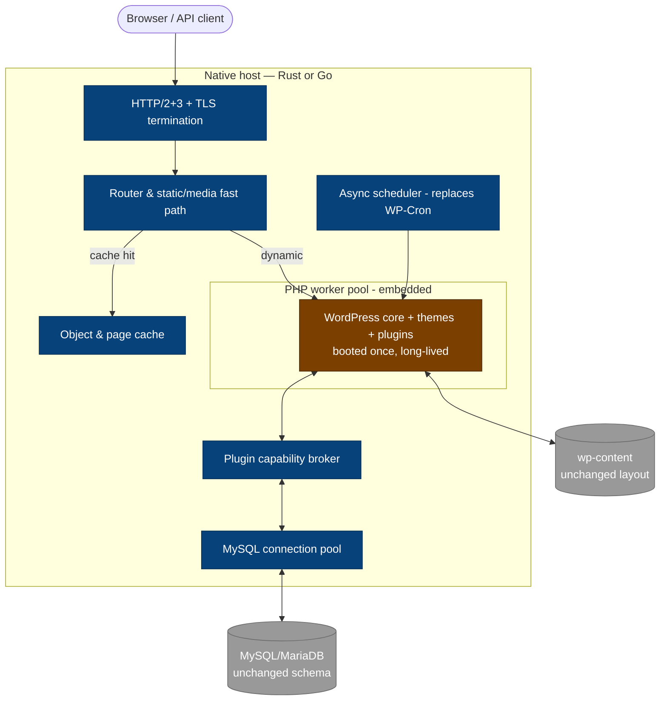

# WordPress Native-Host Rewrite: Architecture & Feasibility

**Status:** Research / feasibility study
**Date:** 2026-08-01
**Question:** Can the WordPress core engine be rebuilt in Rust or Go such that existing themes, plugins, and database data continue to work unchanged, on a more secure, stable, and faster platform?

---

## 1. Problem statement & goals

WordPress powers roughly 40% of the web on an architecture designed in 2003: PHP scripts
bootstrapped from zero on every request, a global-mutable-state programming model, and a
plugin ecosystem with essentially unrestricted access to the process, filesystem, database,
and network. The goals of a rewrite:

1. **Security** — reduce the exploitability of the platform, especially via third-party plugins.
2. **Stability** — long-lived, supervised processes; graceful degradation; no white-screen-of-death.
3. **Performance** — eliminate per-request bootstrap cost; real concurrency; native caching.
4. **Operational simplicity** — single binary, built-in HTTP/TLS, connection pooling, async cron.

**Hard constraints (non-negotiable):**

- Existing themes and plugins work unchanged.
- Existing database schema and data work unchanged.
- The WordPress admin experience keeps working.

## 2. The core constraint that shapes everything

WordPress plugins and themes are **not content or configuration — they are arbitrary PHP
programs that link against WordPress core as a library**. A theme is a set of PHP templates
calling `the_content()`, `wp_head()`, `get_template_part()`, and `WP_Query`. A plugin is PHP
code that registers callbacks into the hook system (`add_action` / `add_filter` — WordPress
core fires thousands of distinct hooks) and calls into a public API surface of several
thousand core functions, freely reading and mutating globals like `$post`, `$wpdb`,
`$wp_query`, and `$wp_filter` along the way.

Therefore "keep plugins and themes working" permits exactly two strategies:

### Strategy A — native host + embedded PHP (recommended)

A Rust or Go **host runtime** owns the process. PHP runs *embedded inside it* and executes
WordPress core, plugins, and themes unchanged. Core services migrate into native code
incrementally, behind the same PHP-visible API (strangler pattern).

### Strategy B — bug-for-bug native reimplementation (rejected)

Reimplement the entire PHP-facing WordPress API natively. This means writing, in effect, a
PHP-semantics emulator plus a WordPress emulator, and matching undocumented behavior across
~60,000 plugins. **HHVM is the cautionary tale**: Facebook built a faster PHP runtime with
enormous resources, and still abandoned PHP compatibility (HHVM v4 dropped PHP support
entirely in 2019 to focus on Hack). If parity-with-PHP defeated Facebook, parity-with-PHP
*plus* parity-with-WordPress is not a viable target for anyone.

The rest of this document is about doing Strategy A well.

## 3. Proposed architecture

The native host owns everything around request execution; embedded PHP executes the
WordPress application layer in **worker mode** — WordPress boots once per worker and serves
thousands of requests, instead of rebuilding the world per request.

**Division of labor:**

| Concern | Owner | Notes |
|---|---|---|
| HTTP, TLS, HTTP/2/3, compression | Native | Replaces nginx/Apache + FPM entirely |
| Static files & media serving/resizing | Native | Never touches PHP |
| Full-page & object cache | Native | Replaces `object-cache.php` drop-ins and cache plugins |
| DB access | Native pool | PHP's `$wpdb` calls proxy through the host's pool |
| Cron / background jobs | Native async scheduler | Kills the "WP-Cron fires on visitor requests" model |
| Search, sitemaps, feeds, REST fast paths | Native (phase 2+) | Behind the same URLs/filters |
| WordPress core, themes, plugins, wp-admin | Embedded PHP | Unchanged code, worker mode |

**The strangler pattern rule:** a subsystem may move native only if it preserves the
PHP-visible contract — same hooks fire, same filters can veto/modify, same output. When any
plugin has registered a filter on a fast path (e.g., `the_content`), the native path must
re-enter PHP for that filter or bypass the fast path entirely. This is the tax that keeps
compatibility honest (see §5.1).

**Prior art proves the load-bearing pieces:**

- [FrankenPHP](https://frankenphp.dev/docs/worker/) — a Go (Caddy) server with PHP embedded;
  worker mode is production-mature in 2026, with
  [3–10x throughput gains over PHP-FPM reported in production write-ups](https://www.phparch.com/2026/07/frankenphp-in-production-worker-mode-embedded-binaries-and-real-performance/),
  and [FrankenWP](https://forum.cloudron.io/topic/14267/frankenwp-wordpress-on-frankenphp)
  demonstrates WordPress specifically, with in-memory caching.
- [WordPress Playground](https://github.com/WordPress/wordpress-playground) — full WordPress
  running on PHP compiled to WebAssembly (php-wasm), PHP 7.4–8.5. Not a production host
  (browser-oriented, ephemeral filesystem), but it proves *unmodified WordPress runs inside
  a WASM sandbox*, which is the seed of the security model in §4.

## 4. Security model — where the real win is

**An honest correction to the intuition "Rust/Go = more secure":** memory-unsafety is not
how WordPress sites get hacked. Per
[Patchstack's 2025 mid-year data](https://patchstack.com/whitepaper/2025-mid-year-vulnerability-report/),
the dominant WordPress vulnerability classes are XSS (~35%), CSRF (~19%), local file
inclusion (~13%), broken access control (~11%), and SQL injection (~7%) — overwhelmingly
**logic bugs in third-party plugin PHP code**, with ~57% exploitable by unauthenticated
visitors. Rewriting core in a memory-safe language fixes approximately none of these,
because the vulnerable code is the plugin code you promised to keep running.

The rewrite's genuine security payoff is that a native host can impose a **capability
boundary around plugins** that no current WordPress deployment has:

1. **Sandboxed execution (phase 3).** Run plugins in PHP-in-WASM instances (Wasmtime for
   Rust; proven feasible by Playground's php-wasm and by
   [Enalean's Wasmtime+PHP untrusted-code PoC](https://github.com/Enalean/poc-php-wasm)).
   A WASM guest has *no* ambient filesystem, network, or process access — only what the
   host broker grants.
2. **Capability manifests.** A plugin declares (or the host infers, then pins) what it
   needs: which DB tables, network egress to which hosts, filesystem paths, which
   capabilities of the WP API. A gallery plugin that suddenly tries to read `wp_users` or
   POST to an unknown host is blocked at the broker, not detected after exfiltration.
3. **SQL at the broker.** With `$wpdb` proxied through the native pool, the host can
   enforce parameterization and per-plugin table ACLs — turning many plugin SQLi bugs from
   "site takeover" into "denied query in the log."
4. **Output-context enforcement.** Long-term, the broker can enforce escaping policy on
   plugin output paths, mitigating the XSS class the same way.

**The self-update problem.** WordPress's own update/install model is "write PHP files to
disk, then execute them" — which is also exactly what a webshell attack does. The host
should make code paths immutable at runtime: installs/updates happen through a host-mediated
transaction (verify signature → stage → swap → restart workers), never through the running
PHP process writing to its own code directory. This single change eliminates the most common
post-exploitation persistence mechanism, at the cost of breaking "edit plugin file in
wp-admin" (an acceptable, even desirable, break — file editing is already commonly disabled
via `DISALLOW_FILE_EDIT`).

## 5. Hard problems / risk register

| # | Risk | Severity | Mitigation |
|---|---|---|---|
| 1 | Hook re-entry cost erases perf wins | High | Hook registry mirrored in host; fast paths only when no plugin filter is registered; batch boundary crossings |
| 2 | PHP-serialized data in DB | High | Implement PHP `serialize()` semantics exactly, with fuzzing against Zend's implementation; never write what we can't round-trip |
| 3 | Hyrum's law across 60k plugins | High | Compatibility is *the* product metric: automated test farm over top-N plugins (start 100, grow to 5,000); bug-for-bug where observable |
| 4 | wp-admin can't go native | Medium | Don't try. Admin stays embedded PHP indefinitely; it's low-traffic |
| 5 | Update/install model conflicts with hardening | Medium | Host-mediated install transactions (§4); document the deliberate breaks |
| 6 | PHP version churn (annual releases) | Medium | Track upstream PHP embed API; FrankenPHP demonstrates this is sustainable |
| 7 | WASM-PHP performance overhead | Medium | Sandbox is opt-in per plugin at first; measure before mandating; native-embed remains the default execution tier |
| 8 | Ecosystem trust / adoption | High | Ship as a drop-in host (replace nginx+FPM, point at existing wp-content + DB), not a new CMS |

Detail on the two highest-severity items:

**5.1 The hook system is the platform.** Filters run synchronously mid-render and may
rewrite anything (`the_content`, `posts_request` — even the SQL). Any native fast path must
consult the hook registry: if a plugin registered a filter on this path, either re-enter PHP
for that callback or fall back to full PHP rendering. Crossing the native↔PHP boundary
thousands of times per request can cost more than it saves, so the design must (a) mirror
hook-registration state on the host side so "no filters registered" is a free check, and
(b) treat "popular plugin X registers filter Y" as a first-class benchmark scenario.

**5.2 PHP semantics live in the database.** `wp_options`, postmeta, usermeta, and widget
settings store PHP-*serialized* strings (`a:2:{s:3:"foo";b:1;...}`), including nested
objects with class names. Native code that reads or writes options must implement PHP's
serialization format and its loose-typing quirks (`"0"` is falsy; array keys `"1"` and `1`
collide; corrupted-length strings are handled leniently by some plugins' custom unserializers)
with exact fidelity, or it silently corrupts sites on first write. This module should be
built first and fuzz-tested against Zend PHP's own `serialize()`/`unserialize()` as the oracle.

## 6. Rust vs Go

Both languages can build this. The decision hinges on which differentiator matters more:
time-to-credible-product (Go) or the sandbox security story (Rust).

| Criterion (weight) | Go — FrankenPHP-style embed | Rust — embed + Wasmtime sandbox |
|---|---|---|
| Prior art / de-risking (high) | **Strong.** FrankenPHP + FrankenWP already run WordPress in worker mode in production; could extend or fork rather than start cold | Moderate. php-wasm proven by Playground; Wasmtime PoCs exist ([Enalean](https://github.com/Enalean/poc-php-wasm)); no production WP host yet |
| PHP embedding ergonomics (high) | **Strong** via FrankenPHP's cgo embed layer (already battle-tested) | Moderate: `php-embed` SAPI via FFI or [ext-php-rs](https://zenn.dev/masakielastic/articles/20250604-ext-php-rs?locale=en); more integration work |
| Sandboxing / capability model (high) | Weak-to-moderate: WASM runtimes exist in Go (wazero) but the ecosystem center of gravity is elsewhere | **Strong.** Wasmtime is Rust-native; WASI capability model aligns exactly with §4 |
| Raw performance ceiling (medium) | Good (GC pauses rarely matter behind PHP workloads) | Marginally better; matters for the native fast paths and serializer |
| Correctness tooling for the risky modules (medium) | Good | **Strong** — the PHP-serializer and SQL-broker modules are exactly where Rust's type system and fuzzing ecosystem pay off |
| Team velocity / hiring (medium) | **Faster** | Slower, steeper curve |
| Single-binary distribution (low) | Excellent (FrankenPHP already ships embedded-app binaries) | Excellent |

**Recommendation:** decide based on the phase-3 commitment.

- If the product thesis is **"the fastest, simplest WordPress host"** → **Go**, building on
  FrankenPHP directly (possibly as upstream contributions + a WordPress-specific layer).
  Phases 0–2 are dramatically de-risked; you may never build the sandbox.
- If the product thesis is **"the first WordPress platform that can actually contain a
  malicious plugin"** — which is the durable differentiator, per §4 — → **Rust + Wasmtime**,
  accepting a slower start for a defensible moat. A pragmatic hybrid (start on FrankenPHP to
  learn the compatibility surface, build the Rust sandbox broker as a sidecar) is credible
  but pays a two-stacks tax.

The honest tiebreaker: **the security story is the only reason to do this project at all.**
Speed alone is already served by FrankenPHP + caching plugins today. That argues Rust —
*if* the multi-year commitment is real.

## 7. Prior art summary

| Project | Lesson |
|---|---|
| [FrankenPHP / FrankenWP](https://frankenphp.dev/docs/worker/) | Native-host-embeds-PHP works in production; worker mode yields 3–10x; WordPress-specific integration exists |
| [WordPress Playground (php-wasm)](https://github.com/WordPress/wordpress-playground) | Unmodified WordPress runs inside a WASM sandbox; PHP 7.4–8.5 supported; [explicitly not a production host](https://wordpress.github.io/wordpress-playground/developers/limitations/) |
| HHVM | Bug-for-bug PHP parity is a graveyard even for Facebook-scale resources; do not reimplement PHP |
| LiteSpeed / OpenLiteSpeed | Server-level WP caching is a proven market; validates the native-cache layer |
| ClassicPress | Forking the PHP codebase without an engine-level thesis gains little adoption |
| Headless WP (REST/GraphQL frontends) | Abandoning theme/plugin compatibility splits you from the ecosystem — reinforces the hard constraint |

## 8. Incremental roadmap

Each phase has a go/no-go gate; the project is designed to deliver standalone value even if
halted after any phase.

**Phase 0 — Proof of concept (validate the scary parts first)**
- Host (chosen language) embedding PHP, serving stock WordPress + one classic theme + one
  block theme + top-10 plugins against an unmodified database.
- Build and fuzz the PHP-serialization module against Zend as oracle.
- Measure hook re-entry cost with a filter-heavy plugin (e.g., an SEO plugin on `the_content`).
- **Gate:** all 10 plugins pass their happy paths; boundary-crossing overhead < 10% of request time.

**Phase 1 — Worker mode + native edge**
- Worker-mode WordPress (boot once), native page/object cache, static/media fast path,
  native cron replacing WP-Cron.
- Compatibility farm: automated install-activate-exercise runs over top-100 plugins.
- **Gate:** ≥3x p50 throughput vs nginx+FPM baseline on a real site; top-100 pass rate ≥98%.

**Phase 2 — Native subsystems behind the facade**
- DB broker (`$wpdb` proxied through native pool), REST API fast paths, sitemaps/feeds,
  search. Hook-registry mirroring so fast paths self-disable when plugins hook them.
- Compatibility farm grows to top-1,000.
- **Gate:** zero observable behavior differences on farm; ops story (single binary, config) complete.

**Phase 3 — Capability sandbox (the differentiator)**
- PHP-in-WASM execution tier for plugins; capability manifests; SQL table ACLs at the
  broker; host-mediated install/update transactions.
- Opt-in per plugin initially; publish containment benchmarks (demonstrate a deliberately
  malicious plugin failing to exfiltrate).
- **Gate:** popular plugins run sandboxed within acceptable overhead; at least one real
  vulnerability class demonstrably contained.

## 9. Verdict

**Feasible — with the reframing.** "Rewrite WordPress in Rust/Go" as commonly imagined
(Strategy B) is not viable; the ecosystem *is* PHP programs, and HHVM already ran that
experiment. But "rebuild the engine *around* unmodified WordPress" (Strategy A) is
buildable incrementally, has production-proven prior art for its riskiest components, and
delivers the stated goals: stability and performance from the worker-mode host (phases 0–2,
largely de-risked by FrankenPHP), and a genuine, novel security improvement from the
capability sandbox (phase 3, the hard part and the reason to prefer Rust). The database,
themes, and plugins never change — which was the constraint that made the ambition
interesting in the first place.
