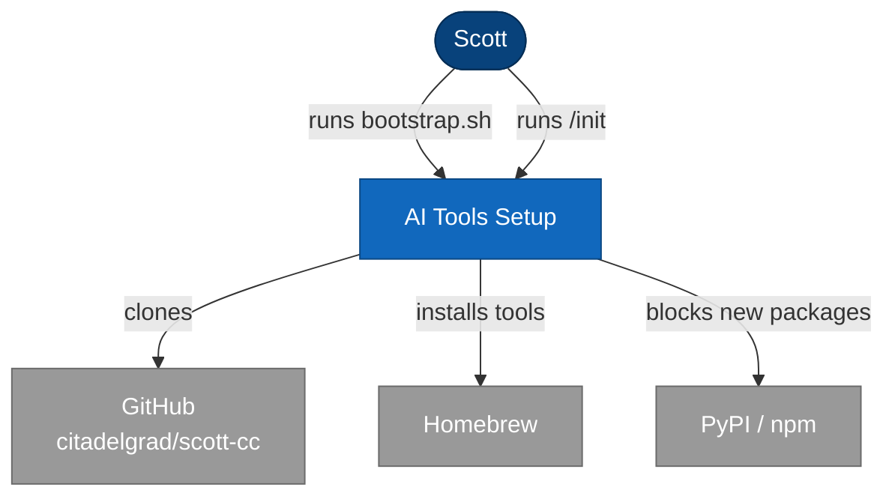
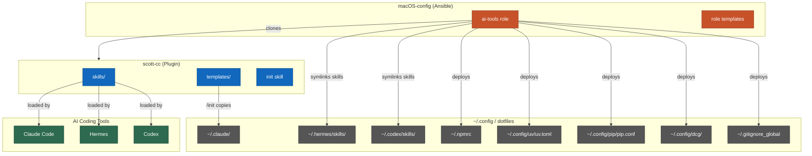
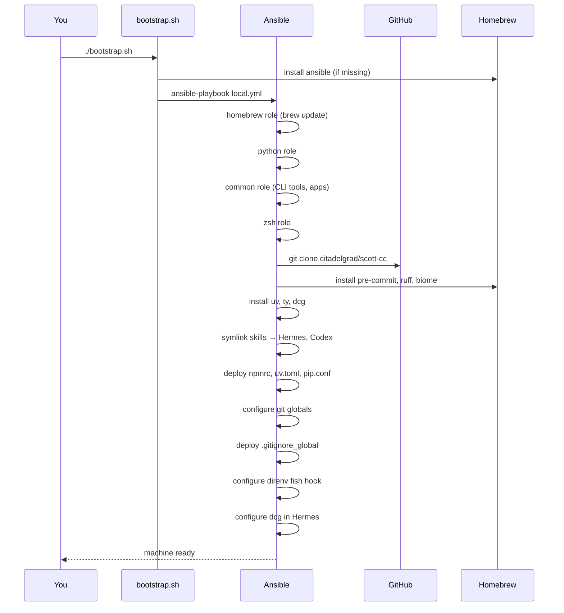
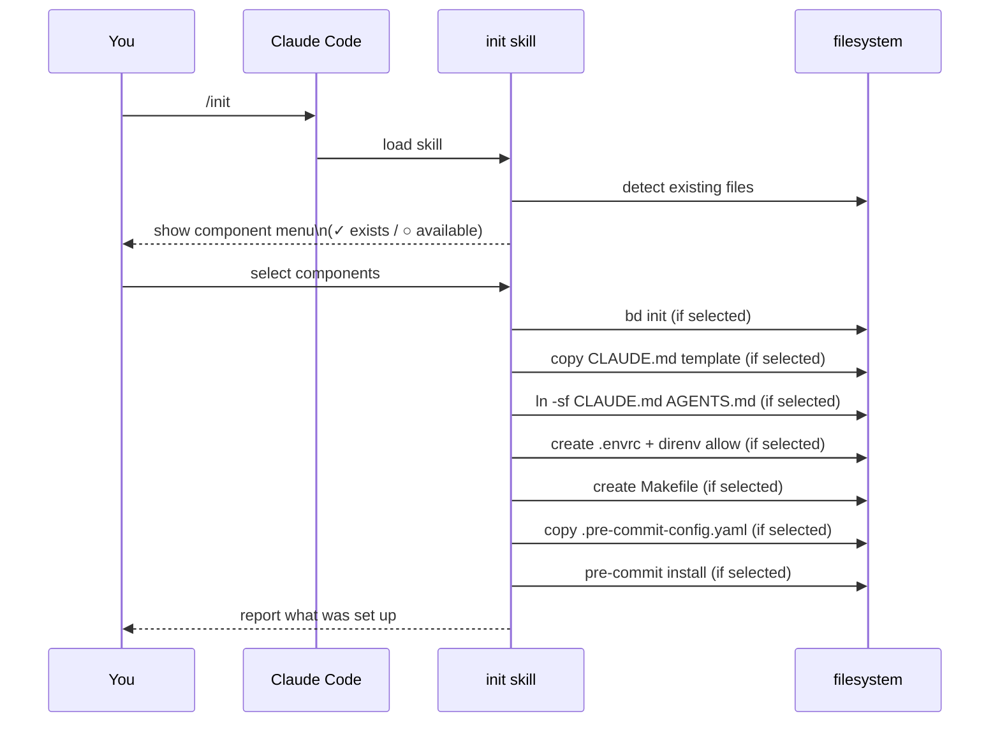
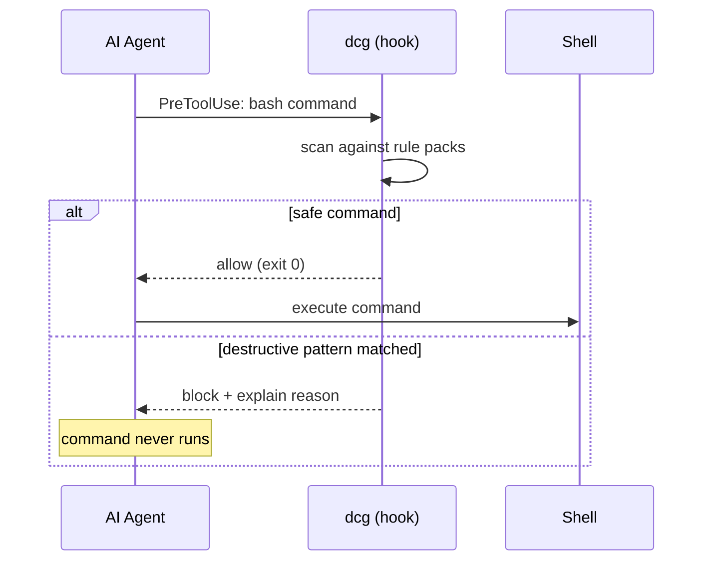

# Setup Architecture

## Overview

Scott's AI coding environment uses a three-layer setup system. Layer 1 (Ansible) runs once per machine via `bootstrap.sh` and installs all tools, configures security guardrails, and symlinks skills into Hermes and Codex. Layer 2 (scott-cc plugin) is installed manually in Claude Code via the plugin marketplace and provides skills, agents, and commands. Layer 3 (the `init` skill) is run per-project to scaffold CLAUDE.md, AGENTS.md, .envrc, Makefile, and pre-commit hooks interactively.

## System Diagram (C4 Context)



| Node | Description |
|------|-------------|
| Scott | Developer running the setup |
| AI Tools Setup | Ansible ai-tools role + scott-cc plugin + init skill |
| GitHub citadelgrad/scott-cc | Plugin source, skill definitions, templates |
| Homebrew | Installs pre-commit, ruff, biome |
| PyPI / npm | Package registries — age-restricted to block supply chain attacks |

## Component Diagram (C4 Container)



| Component | Description |
|-----------|-------------|
| ai-tools role | Ansible role in macOS-config; runs once per machine |
| role templates | Ansible-managed config templates (npmrc, uv.toml, pip.conf, etc.) |
| skills/ | Skill definitions shared across Claude Code, Hermes, Codex |
| templates/ | Reusable project templates (CLAUDE.md, AGENTS.md, .pre-commit-config.yaml) |
| init skill | Interactive project scaffolding skill |
| ~/.claude/ | Claude Code config dir — CLAUDE.md lives here at global level |
| ~/.hermes/skills/ | Hermes skill directory — populated via symlinks from scott-cc |
| ~/.codex/skills/ | Codex skill directory — populated via symlinks from scott-cc |

## Bootstrap Sequence

What happens when you run `./bootstrap.sh` on a new Mac:



## Project Init Sequence

What happens when you run `/init` in a new project:



## Command Guard Flow

What happens when Claude Code or Hermes runs a shell command:



`dcg` (destructive command guard) is a Rust binary installed by Ansible. It runs as a PreToolUse hook in Claude Code, Hermes, and Codex, intercepting shell commands before execution and blocking patterns like `rm -rf /`, force-pushes to main, credential-touching commands, etc.

## How to Bootstrap a New Mac

1. Clone macOS-config:
   ```bash
   git clone https://github.com/citadelgrad/macOS-config.git && cd macOS-config
   ```
2. Run bootstrap (takes 10–20 min, installs everything):
   ```bash
   ./bootstrap.sh
   ```
3. Install the scott-cc plugin in Claude Code:
   ```
   /plugin marketplace add citadelgrad/scott-cc
   ```
4. Done — skills are available in Claude Code, Hermes, and Codex automatically.

## How to Set Up a New Project

1. `cd` into your project directory.
2. Run `/init` in Claude Code (or invoke the init skill in Hermes).
3. Select which components you want from the menu.
4. Done — the skill handles everything and reports what was created.

## Keeping Things Up to Date

| What | How | When |
|------|-----|-------|
| scott-cc skills | `cd ~/projects/oss/scott-cc && git pull` | When you want new/updated skills |
| Claude Code plugin | `/plugin update scott-cc` | Independent of skills — updates agents/commands |
| dcg | `dcg update` | Automatically done by Ansible on next run |
| pre-commit hooks | `pre-commit autoupdate` in each project | When hook versions go stale |
| Full machine re-sync | `cd ~/path/to/macOS-config && ansible-playbook local.yml -K` | After OS upgrade or new machine |

## Configuration Reference

| File | Purpose | Managed by |
|------|---------|------------|
| `~/.npmrc` | Blocks npm packages < 3 days old | Ansible ai-tools role |
| `~/.config/uv/uv.toml` | Blocks Python packages < 3 days old | Ansible ai-tools role |
| `~/.config/pip/pip.conf` | Blocks pip packages < 3 days old | Ansible ai-tools role |
| `~/.gitignore_global` | Global git ignores (.DS_Store, .env, etc.) | Ansible ai-tools role |
| `~/.config/dcg/config.toml` | dcg rule packs (which commands to guard) | Ansible ai-tools role |
| `~/.hermes/skills/` | Skills available in Hermes | Ansible (symlinks to scott-cc) |
| `~/.codex/skills/` | Skills available in Codex | Ansible (symlinks to scott-cc) |
| `~/.claude/CLAUDE.md` | Global Claude Code instructions | Manual (template in scott-cc/templates/) |
| `~/.codex/AGENTS.md` | Global Codex instructions | Manual (template in scott-cc/templates/) |
| `~/projects/oss/scott-cc/` | Plugin source + skill definitions | `git pull` to update |
| `.pre-commit-config.yaml` | Per-project commit hooks | Copied by `/init` skill |
