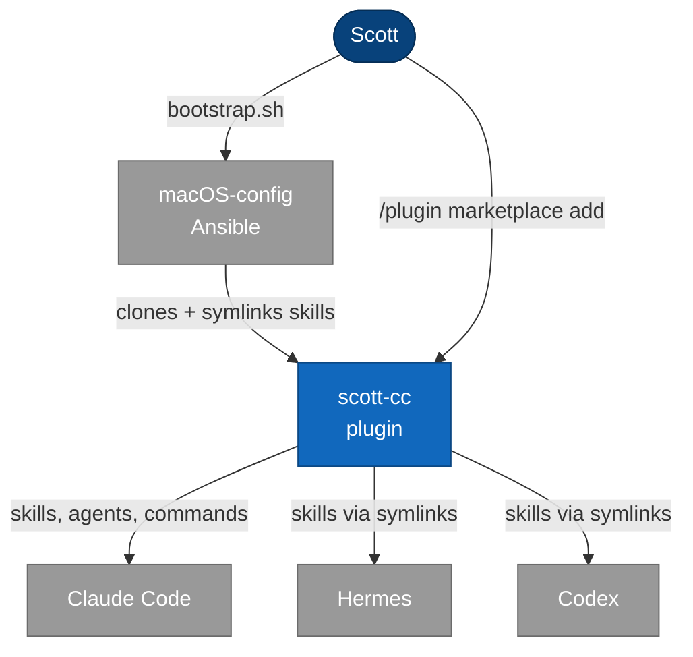
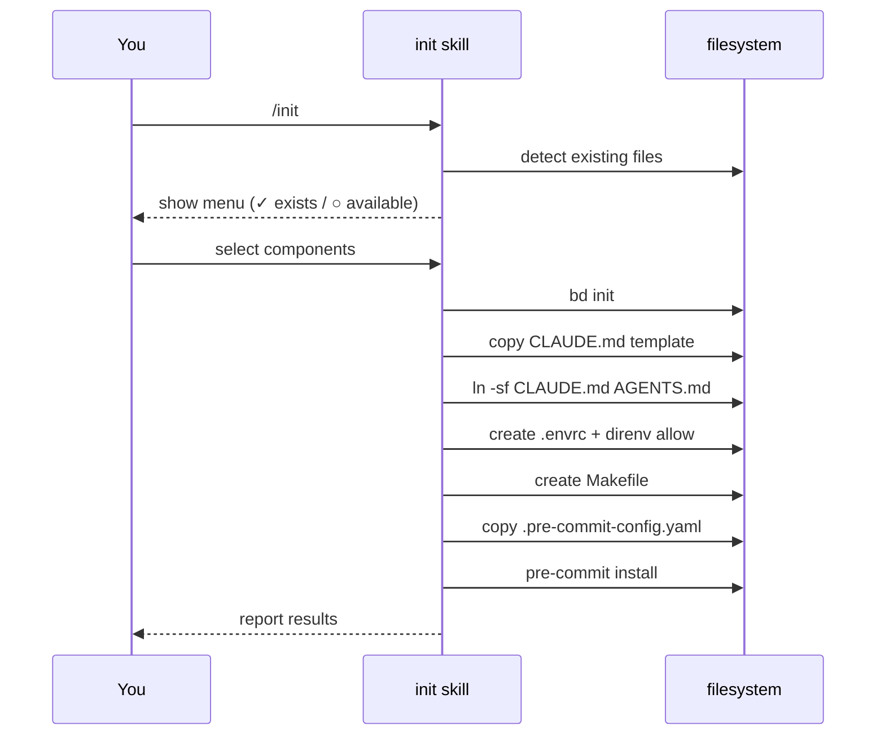

# Setup Architecture

This plugin is one layer of a three-layer setup system. Full machine bootstrap and configuration details live in the companion repo: **[citadelgrad/macOS-config](https://github.com/citadelgrad/macOS-config)**.

## The Three Layers

| Layer | What | How |
|-------|------|-----|
| 1 — Machine | Ansible `ai-tools` role | `./bootstrap.sh` in macOS-config — clones this repo, symlinks skills into Hermes/Codex, installs tools, deploys security configs |
| 2 — Plugin | This repo (scott-cc) | `/plugin marketplace add citadelgrad/scott-cc` in Claude Code |
| 3 — Project | `/init` skill | Run per-project to scaffold CLAUDE.md, AGENTS.md, .envrc, Makefile, pre-commit hooks |

## Where This Plugin Fits

## Project Init Sequence

What happens when you run `/init` in a project directory:

## Full Setup Documentation

For bootstrap instructions, configuration reference, dcg command guard details, and the complete component diagram, see:

→ **[citadelgrad/macOS-config](https://github.com/citadelgrad/macOS-config)**
