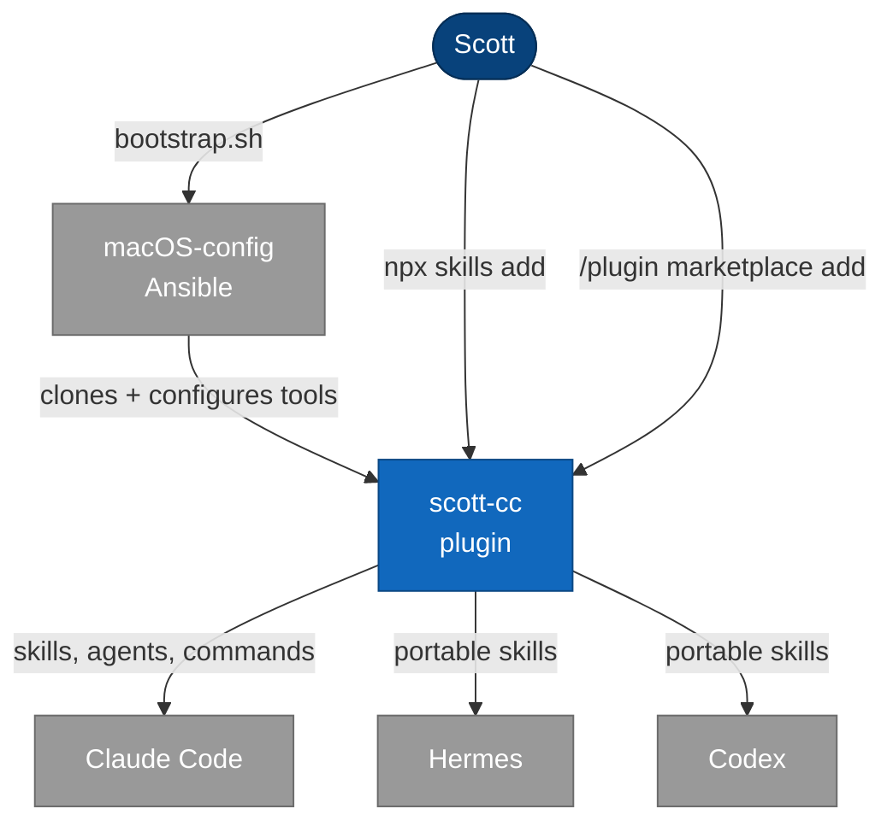
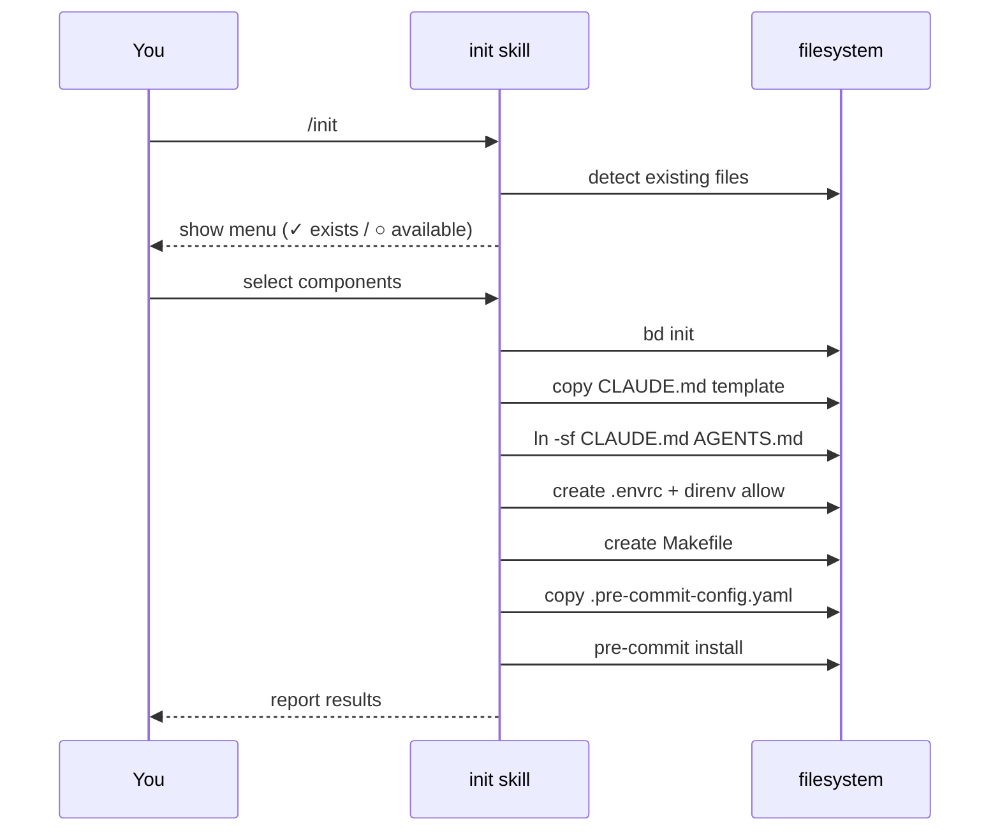

# Setup Architecture

This repository participates in a four-layer setup system. Full machine bootstrap and configuration details live in the companion repo: **[citadelgrad/macOS-config](https://github.com/citadelgrad/macOS-config)**.

## The Four Layers

| Layer | What | How |
|-------|------|-----|
| 1 — Machine | Ansible `ai-tools` role | `./bootstrap.sh` in macOS-config — clones this repo, installs tools, deploys security configs |
| 2 — Portable skills | This repo (scott-cc) | `npx skills add citadelgrad/scott-cc` — select skills for Codex, Hermes Agent, Claude Code, or other agents |
| 3 — Claude plugin | This repo (scott-cc) | `/plugin marketplace add citadelgrad/scott-cc` in Claude Code |
| 4 — Project | `/init` skill | Run per-project to scaffold CLAUDE.md, AGENTS.md, .envrc, Makefile, pre-commit hooks |

## Where This Plugin Fits

```mermaid
flowchart TB
    classDef person fill:#08427b,color:#fff,stroke:#052e56
    classDef system fill:#1168bd,color:#fff,stroke:#0b4884
    classDef external fill:#999,color:#fff,stroke:#6b6b6b

    scott([Scott]):::person
    ansible[macOS-config\nAnsible]:::external
    plugin[scott-cc\nplugin]:::system
    cc[Claude Code]:::external
    hermes[Hermes]:::external
    codex[Codex]:::external

    scott -->|bootstrap.sh| ansible
    ansible -->|clones + configures tools| plugin
    scott -->|npx skills add| plugin
    scott -->|/plugin marketplace add| plugin
    plugin -->|skills, agents, commands| cc
    plugin -->|portable skills| hermes
    plugin -->|portable skills| codex
```

The portable path installs only `SKILL.md` packages. Claude-specific agents, commands, hooks, and sub-plugin wiring require the Claude plugin path. See [skills-cli.md](skills-cli.md).

## Project Init Sequence

What happens when you run `/init` in a project directory:

```mermaid
sequenceDiagram
    participant U as You
    participant S as init skill
    participant FS as filesystem

    U->>S: /init
    S->>FS: detect existing files
    S-->>U: show menu (✓ exists / ○ available)
    U->>S: select components
    S->>FS: bd init
    S->>FS: copy CLAUDE.md template
    S->>FS: ln -sf CLAUDE.md AGENTS.md
    S->>FS: create .envrc + direnv allow
    S->>FS: create Makefile
    S->>FS: copy .pre-commit-config.yaml
    S->>FS: pre-commit install
    S-->>U: report results
```

## Full Setup Documentation

For bootstrap instructions, configuration reference, dcg command guard details, and the complete component diagram, see:

→ **[citadelgrad/macOS-config](https://github.com/citadelgrad/macOS-config)**
