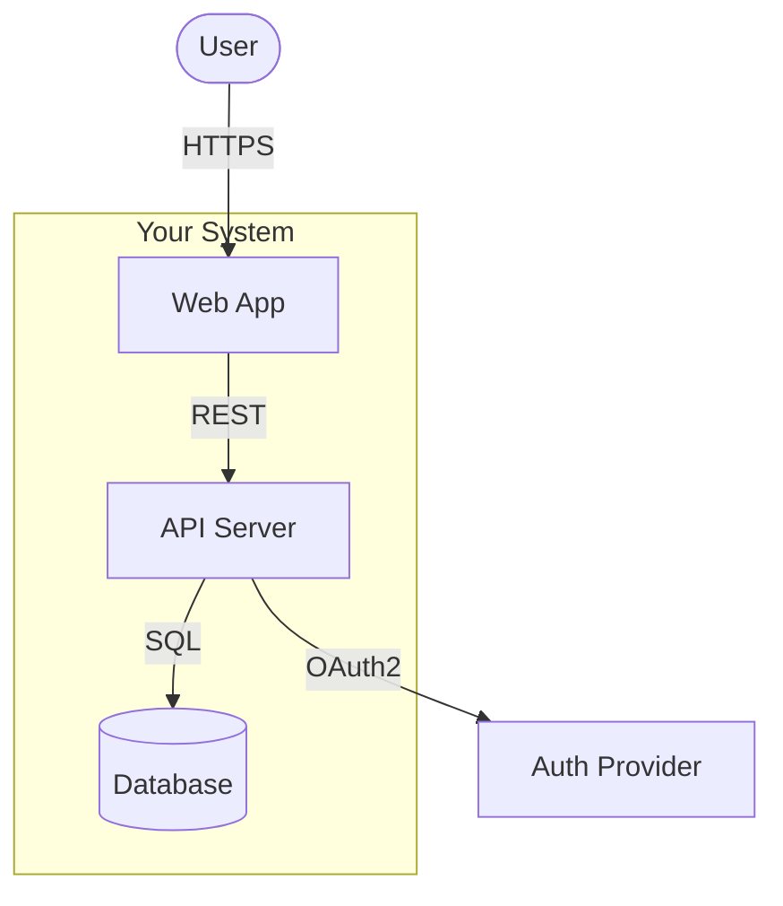
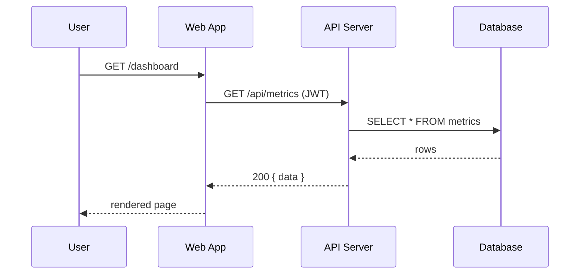

# C4 Architecture Diagrams

Generate C4-model architecture diagrams using standard Mermaid `flowchart` syntax.

**Why not the Mermaid C4 plugin?** The `C4Context`/`C4Container`/`C4Component` Mermaid plugin produces overlapping labels and broken layout. Use `flowchart TB` or `flowchart LR` with manual C4 styling instead.

Use this skill when:
- Creating a new architecture diagram from scratch
- Documenting a system at Context, Container, or Component level
- Adding a sequence diagram to show runtime behavior
- Reviewing an existing diagram for label length or layout issues

---

## Step 1: Choose the C4 Level

| Level | Shows | Use when |
|---|---|---|
| **Context** | System + external actors/systems | Onboarding, stakeholder docs |
| **Container** | Services, DBs, queues inside the system | Architecture decisions, team handoffs |
| **Component** | Modules/classes inside one container | Code-level design, deep dives |

Start at Context. Add Container only if Context leaves important questions open. Add Component only if a specific container is the focus of the document.

---

## Step 2: Collect the Pieces

Before writing any Mermaid, list out:

1. **People** — external users/actors (e.g. "Developer", "Customer")
2. **Your system** — the system being described
3. **External systems** — APIs, services, data stores outside your system boundary
4. **Containers** (if Container level) — each deployable unit: web app, API server, DB, queue, etc.
5. **Relationships** — who calls what, data direction, protocol (HTTP, SQL, AMQP, etc.)

---

## Step 3: Write the Diagram

### Layout choice

- `flowchart TB` — top-to-bottom. Use for hierarchical diagrams (Context and Container levels).
- `flowchart LR` — left-to-right. Use for sequence-like flows or pipeline diagrams.

### Node label rule

**Node labels must be 5 words or fewer.** Put all detail in the legend table (Step 4), not inside node text. Long labels break Mermaid layout.

```
Good: User, Web App, Auth Service, Postgres DB
Bad:  "User who initiates a login flow", "REST API Service (Node.js/Express on port 8080)"
```

### Node shapes by type

| C4 Type | Mermaid shape | Syntax |
|---|---|---|
| Person | Stadium (rounded) | `id([Label])` |
| System (yours) | Rectangle | `id[Label]` |
| External system | Rectangle | `id[Label]` |
| Container | Rectangle | `id[Label]` |
| Database | Cylinder | `id[(Label)]` |
| Queue | Subroutine | `id[[Label]]` |

### Color coding by type

Apply these styles after the diagram body — color distinguishes C4 types at a glance:

```mermaid
%% Person: blue
style PersonNodeId fill:#1168bd,color:#fff,stroke:#0b4884

%% Your system / containers: dark blue  
style SystemNodeId fill:#1168bd,color:#fff,stroke:#0b4884

%% External system: grey
style ExternalNodeId fill:#999,color:#fff,stroke:#7a7a7a

%% Database: dark green
style DBNodeId fill:#2d6a4f,color:#fff,stroke:#1b4332

%% Queue: orange
style QueueNodeId fill:#e76f51,color:#fff,stroke:#c45c3a
```

### Subgraph for system boundary

Wrap your system's components in a subgraph to show the boundary:



### Edge labels

Keep edge labels short: the protocol or verb only.
```
Good: HTTP, SQL, AMQP, reads, writes, calls
Bad:  "sends an authenticated POST request to /api/v1/users"
```

---

## Step 4: Write the Legend Table

Every diagram gets a companion legend table immediately below the Mermaid block. This is where detail lives.

```markdown
| Node | Type | Description |
|---|---|---|
| User | Person | Authenticated developer using the web UI |
| Web App | Container | Next.js frontend, port 4231 |
| API Server | Container | Node.js/Express REST API, port 7841 |
| Database | Container | PostgreSQL 16, stores all application state |
| Auth Provider | External | GitHub OAuth2 for user authentication |
```

---

## Step 5: Add a Sequence Diagram (Runtime Behavior)

For any diagram showing a non-trivial flow (auth, async jobs, multi-system transactions), add a `sequenceDiagram` block after the C4 diagram and legend. This shows the runtime behavior the C4 diagram can only imply.



Keep sequence diagrams to the critical path — not every possible code path. If a sequence diagram would be longer than ~15 lines, split it into multiple named flows.

---

## Step 6: Save the File

Save all diagrams as `.md` files in the project's `docs/` directory.

Naming convention:
```
docs/architecture-context.md       ← Context level
docs/architecture-containers.md    ← Container level
docs/architecture-auth-flow.md     ← Focused topic (includes sequence)
```
