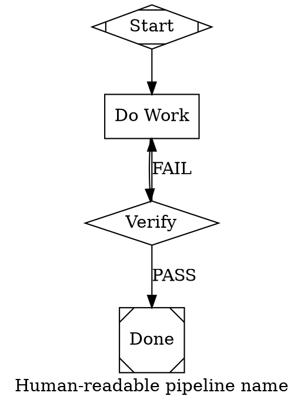

# PAS Provider Detection and DOT Authoring

Use this reference before hand-authoring or modifying a PAS pipeline. It is verified against PAS 0.9.4.

## 1. Detect authenticated subscription CLIs

PAS executes agent nodes through a provider CLI. Hermes Agent is the host running this skill; it is not a valid `llm_provider` value.

Check only the providers relevant to the current environment:

```bash
command -v codex && codex --version && codex login status
command -v claude && claude --version && claude auth status --json
command -v gemini && gemini --version
```

Interpret the results conservatively:

- `codex login status` reporting `Logged in using ChatGPT` means Codex can use that ChatGPT account's subscription-backed catalog. It does not reveal the account's exact plan tier.
- Claude `"loggedIn": true` with an OAuth auth method means Claude Code subscription authentication is available.
- A binary existing is not proof that it is authenticated. Do not select a provider after a failed status check.
- Do not inspect or print tokens, API keys, credential files, or keychain contents.

### Provider selection

1. When this skill is running in Codex and Codex subscription auth works, use `llm_provider="codex"`.
2. When the user explicitly requests a provider, verify that provider's CLI and auth before using it.
3. In Hermes Agent, select an authenticated CLI provider; do not write `llm_provider="hermes"` or `"hermes-agent"` because PAS does not support those values.
4. If multiple providers are authenticated and neither the host nor the user establishes a preference, ask the user rather than silently choosing a billing or subscription surface.
5. If no provider CLI is authenticated, stop before `pas run` and report the failed checks.

Valid PAS CLI-provider values are `claude`, `codex`, and `gemini` (`anthropic`, `openai`, and `google` are accepted aliases, but canonical names are clearer).

## 2. Select a model without guessing

The safest default is to omit both graph-level `model` and node-level `llm_model`. PAS then lets the selected provider CLI use the model configured and available for that authenticated account.

This matters for Codex: `model="sonnet"` is a Claude alias. Combining it with `llm_provider="codex"` makes PAS pass `--model sonnet` to Codex, which is wrong.

When the user requires an explicit Codex model, query the authenticated catalog:

```bash
codex debug models
```

Use an exact `slug` returned by that command, then set it with `llm_model="<slug>"`. The catalog is account- and release-dependent; never copy a stale model name from this skill. If the catalog command is unavailable on an older Codex CLI, omit the model and use the account default rather than guessing.

`reasoning_effort` is a separate PAS node attribute. Only use an effort advertised by the selected model's catalog. Omit it to use that model's configured default.

## 3. Author the strict PAS DOT dialect

Start from `assets/codex-pipeline.dot`. The minimum reliable structure is:



### Required structural contract

- Use `digraph`, bare ASCII identifiers, and `->`; PAS accepts only its strict DOT subset.
- Define exactly one start node with `shape="Mdiamond"` and one exit node with `shape="Msquare"`.
- Every `box` task node needs a `prompt`.
- Every conditional `diamond` needs a `prompt` and should explicitly set `node_type="conditional"`.
- Put `llm_provider` on every agent node. Do not rely on PAS's default (`claude`) when generating a pipeline for Codex.
- `label` is optional for ordinary nodes—the node ID is the fallback—but explicit human-readable labels make logs and reviews understandable.
- For each conditional outcome, use the same exact token in all three places:
  1. The conditional prompt's required final-line response.
  2. The outgoing edge's `label`.
  3. The edge condition's `preferred_label=<TOKEN>` value.
- Prefer short, unique, uppercase routing tokens such as `PASS` and `FAIL`.
- Set `loop_restart=true` on a back-edge that must clear completed-node state before re-execution.
- Quote strings. Use unquoted booleans and durations where practical.
- Do not use quoted node IDs, numeric-only IDs, HTML labels, ports, undirected edges, or chained attribute blocks.

## 4. Validate before execution

Run both commands after every generated or edited pipeline:

```bash
pas validate pipelines/my-pipeline.dot
pas info pipelines/my-pipeline.dot
```

Treat `pas validate` exit code 1 as blocking. Review warnings too; exit code 0 means there were no errors, not necessarily no warnings.

For a first execution, keep the worktree sandboxed and use:

```bash
pas run pipelines/my-pipeline.dot -w . --dry-run --max-steps 20
```

A conditional node in dry-run mode produces no provider response, so PAS may warn that no edge condition matched and fall back to the first edge. That warning is expected in a structural dry run; it does not prove live label routing works.

For Codex and Gemini nodes, PAS cannot currently read per-call dollar cost from CLI output. `--max-budget-usd` therefore does not enforce real spend for those providers. Use subscription limits plus `--max-steps`, node timeouts, narrowly bounded prompts, and an isolated worktree. PAS currently invokes Codex non-interactively with broad execution permissions, so do not run an unreviewed pipeline against a sensitive worktree.

## 5. Label mismatch diagnosis

If validation passes but runtime routing fails:

1. Inspect every outgoing edge from the conditional node.
2. Confirm labels are unique.
3. Confirm the prompt demands one exact label on the final line.
4. Confirm each condition is `preferred_label=<same exact label>`.
5. Remove prose-friendly variants such as `Pass`, `PASSED`, or `FAIL: reason` from the final-line contract.
6. Re-run `pas validate` and `pas info`, then use a bounded dry run.
